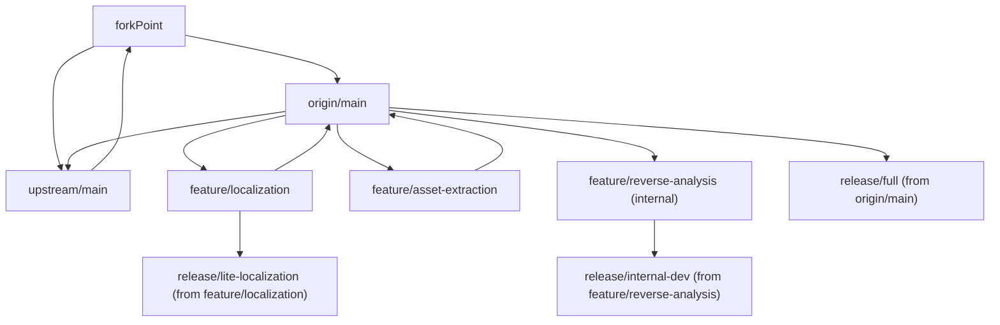

# Git Management Strategy

## Purpose

This document defines the repository flow after forking, the active development branches, and release channels for different audiences.

## Repository Relationship

- Upstream repo (`chinosk6/scsp-localify`) continues on `upstream/main`.
- Fork repo (`J1ejiE369/scsp-localify`) has its own `origin/main` from the fork point.
- Feature development happens in fork branches, then merges back to `origin/main`.
- Upstream contribution is done by PR from `origin/main` to `upstream/main`.

## Branch Roles

### Base branches

- `upstream/main`: upstream maintained baseline.
- `origin/main`: fork integration branch and full release source.

### Active feature branches

- `feature/reverse-analysis`
  - Internal reverse-analysis support only.
  - Used to find hook points, export runtime symbols, and produce trace JSON.
  - Focuses on symbol table export; may later include runtime logic script export if feasible.
  - Not intended for end-user distribution.
- `feature/asset-extraction`
  - Runtime model and scene dump capability.
  - May also be used for extracting UI texture elements.
  - Intended to merge into `origin/main`.
  - Intended to be upstream PR candidate.
- `feature/localization`
  - Translation-focused branch.
  - Can be used both for integration into full release and for lightweight translation-only release.

### Legacy branch

- `feature/model-dumper-legacy`
  - Historical branch retained for reference.
  - No new feature development should continue here.
  - Useful changes must be migrated into `feature/asset-extraction`.

## Development Rules

1. Daily development switches only between:
   - `feature/reverse-analysis`
   - `feature/asset-extraction`
   - `feature/localization`
2. Cross-feature changes are not mixed in one commit.
3. Integration order:
   - Feature branch -> `origin/main`
   - Then `origin/main` -> upstream PR (when appropriate)
4. `feature/reverse-analysis` is internal tooling branch; merge only minimal reusable infrastructure when justified.

## Release Channels

### Channel A: Full Release (default user release)

- Source branch: `origin/main`
- Includes:
  - Translation features
  - Model dump features
  - Necessary low-level support required by those features

### Channel B: Lightweight Translation Release

- Source branch: `feature/localization` or a release branch cut from it
- Includes:
  - Clean translation replacement workflow
  - Only minimal required low-level compatibility pieces
- Excludes:
  - Developer-oriented features such as free camera or analysis tooling unless strictly required

### Channel C: Internal Developer Build

- Source branch: `feature/reverse-analysis` (optionally combined with temporary `spike/*`)
- Includes:
  - Reverse-analysis hooks
  - Symbol/trace export tools
  - Experimental diagnostics
- Not for public distribution

## Merge and Upstream Policy

- `feature/asset-extraction`:
  - Merge to `origin/main` after validation.
  - Submit upstream PR via `origin/main` when stable.
- `feature/localization`:
  - Merge selectively to `origin/main` for full release.
  - Can also ship as lightweight branch release.
- `feature/reverse-analysis`:
  - Keep mostly internal.
  - Upstream only general-purpose fixes that are user-safe and maintainable.

## Branch Graph (Vertical View)

## Practical Checklist Before Merge

- Feature scope isolated to correct branch.
- Validation evidence attached (runtime log, dump check, import result, or translation regression evidence).
- No accidental developer-only diagnostics in user release.
- Submodule pointer changes (`deps/*`) are intentional and documented.
