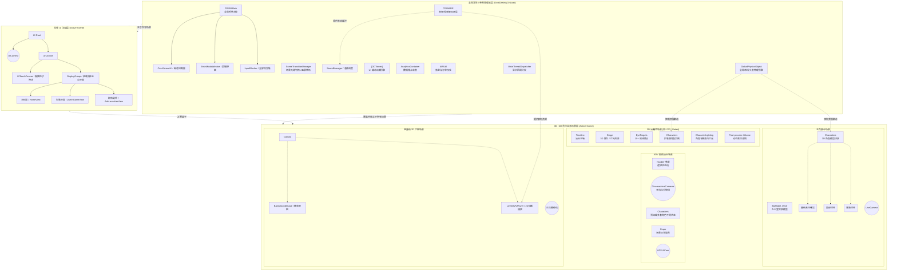

# 《偶像大师 闪耀色彩 Song for Prism》(SCSP) 运行时架构逆向分析报告

## 1. 概述
本报告基于 SCSP 在 PC/Windows 平台运行时的 Native C++ 注入，通过 Hook Unity 主线程底层的 `MainThreadDispatcher_LateUpdate`，在游戏运行的特定生命周期节点（如主页、换装、剧情、3D/2D MV）触发的场景树全量 Dump 数据整理而成。

Dump 采用深度限制（Depth=3）策略，有效规避了对象循环引用与数据爆炸问题，清晰地暴露了该游戏（基于 Unity 引擎开发）的宏观内存管理模式、UI 层级策略、动画装配管线以及高/低端机型适配架构。

---

## 2. 核心架构模式分析

### 2.1 全局管理器集群（DontDestroyOnLoad）
通过多次跨场景的 Dump 对比发现，游戏没有采用传统的“大一统”单例脚本，而是严格遵循了**组件化与职责单一**的 Manager 模式。这些对象在游戏启动时被创建，并常驻于全局隐藏场景中：
*   **底层基石**：`[DOTween]`（UI 缓动引擎）、`CRIWARE`（音视频解码中间件）、`MainThreadDispatcher`（异步网络请求的主线程回调调度）。
*   **业务基石**：`IAPUtil`（防掉单的应用内购处理）、`AnalyticsContainer`（数据埋点与异常上报容器）。
*   **顶层系统界面的剥离**：游戏将最容易报错的系统级 UI（如 `InputBlocker` 防误触遮罩、`Connecting` 菊花转圈、`ErrorModalWindow` 断网重连弹窗）全部挂载在常驻的 `PRISMMain(Clone)` 下，彻底与局内的具体业务 UI 脱钩。这意味着无论你在打歌还是看剧情，断网时的提示永远是那套绝对安全、不会被意外销毁的底层 UI。

### 2.2 极致的 UI 分层与多摄像机隔离
游戏彻底摒弃了单一 `Camera` 渲染一切的粗暴做法，采用了**物理隔离的摄像机渲染栈（Camera Stack）**：
*   **UI 专属**：`UI` 节点下拥有独立的 `UICamera`，专门渲染常规界面（如 `HomeView`, `LiveInGameView`）。
*   **3D 专属**：根据不同业务，动态挂载 `LiveCamera`（演唱会运镜）、`ADVUICam`（剧情对话摄像机）、`ShakeCam`（震动特效专机）。
*   **多重防穿帮遮罩**：除了系统的黑屏加载 `SceneTransitionManager`，在多角色集结加载时（如 5人小队准备 ADV 剧情），还会额外挂载 `FaderCanvas` 用最高层级的黑幕挡住模型初始化的穿模瞬间。

### 2.3 “拆件纸娃娃”与高度解耦的面部动画管线
在 `SpawnCharacter`（换装）与 `Characters`（主页/剧情）节点下，揭示了其 3D 角色的顶级工业化管线：
*   **模型拆件**：角色由 `MODEL_00`（基础骨架）、`face`、`hair`、`accessory`、`dress` 动态拼装而成，而非一整张网格。
*   **面部表情的“节点化映射” (`LayerWeightReciever`)**：
    这是最惊艳的发现！动画师并没有在动画文件（.anim）里直接控制生硬的 BlendShape（融合变形），而是在角色骨架下创建了海量的**空 GameObject 节点**（如 `LipA`, `Serious`, `EyeClose_R`, `EBUpL`）。
    动画文件只负责记录这些“空节点的 Transform XYZ 坐标/缩放”作为权重值；运行时的脚本再读取这些值，统一映射到面部的 BlendShape 上。这种**中间件式**的设计，让不同角色的面部拓扑即便不同，也能完美复用同一套表情动画资产。

### 2.4 性能优化的妥协：多级物理与光照欺骗
*   **双规物理系统**：全局使用次世代的 `GlobalPhysicsObject`（推测为 MagicaCloth）处理绝大多数衣服和头发的物理碰撞。但遇到特定角色的超大裙摆或复杂配饰（如 `m_ALL_07` 角色）时，会自动 fallback 并单独挂载传统的 `SwayBone` 与独立的 `SwayBoneManager` 进行局部结算，防止全局物理算力爆炸。
*   **专属美颜打光 (`CharacterLighting`)**：无论在 3D 打歌舞台（深红、深紫聚光灯）还是黄昏的办公室，角色节点下永远跟着一个专属的 `CharacterLighting` 灯光组。这套灯光利用 Unity 的 Layer Culling Mask，**只照偶像的脸，绝对不照背景**，确保角色肤色永远白皙透亮。脚底的阴影甚至放弃了实时计算，使用 `PlaneDropShadow(Clone)` 贴图假阴影代替。

### 2.5 电影化剧情与可伸缩 Live 架构
*   **Timeline驱动的 3D Live (`023_Watasi`)**：打歌模式并非靠写死的代码运行。游戏将整首歌的舞台（`Stage_000500`）、后方大屏幕（`MONITOR` 配合 `CriManaMovieResources` 播放预渲染视频）、10个目光追踪点（`EyeTargets`）全部打包。核心是一根 `Timeline` 轨道，以毫秒级精度控制着偶像走位、运镜和聚光灯扫描。
*   **电影分镜级剧情 (`CinemachineCameras`)**：在 `s44_0101...` 的剧情演出中，使用了多达几十台虚拟摄像机（`s1c1`, `s3c4`, `flashback_1`），通过 Timeline 在不同机位间（Cut）切换，实现了电影般的镜头语言。
*   **极限省电的 2D 轻量模式 (`LightweightLiveScene`)**：当玩家关闭 3D MV 时，游戏展现了极佳的解耦性。上层打歌 UI (`LiveMVOverlayView`) 原封不动，而底层几百个节点的 3D 舞台瞬间被清空，替换为一个只有简单正交 `Camera` 和一张底图 (`BackgroundImage`) 或一个视频播放器 (`Live2DMVPlayer`) 的空壳场景，将 GPU 压力降至冰点。

---

## 3. 架构可视化图表 (Mermaid)

以下图表展示了 SCSP 在运行时的整体内存树状结构与层级关系：

## 4. 结语
通过 F10 内存 Dump 的深入剖析，《SCSP》展现了一套极高水准的移动端 3D 偶像游戏架构标准。其将表现层（UI）、状态层（Manager）、演出层（Timeline/Cinemachine）与资源层（模型/贴图）完美解耦。这种架构使得游戏在应对未来持续更新几十首新歌、几百套新服装时，依然能够保持逻辑的稳定与渲染的丝滑。
